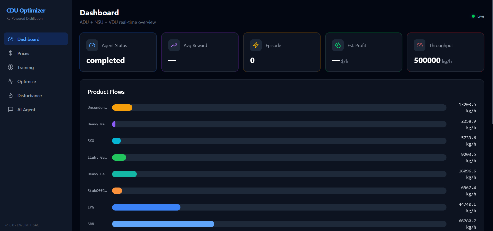

# CDU Optimizer — RL-Powered Crude Distillation Unit

A Deep Reinforcement Learning system that optimizes a Crude Distillation Unit (CDU)
simulated in DWSIM to maximize profitability across product streams.



---

## Repo Navigation guide:

Folders-------------------------|-----------------------Remarks

Assay data----------------------|-----------------------Contains assay related files in xls & pdf

backend-------------------------|-----------------------FastAPI backend for app

Data Analysis-------------------|-----------------------Data analysis notebook

distvenv------------------------|-----------------------Virtual Env for app

frontend------------------------|-----------------------Nextjs front end app

Report--------------------------|-----------------------Whitepaper report for the project

RL_agent------------------------|-----------------------RL agent training notebook

scripts-------------------------|-----------------------back-up scripts for testing aux func

Sim_models----------------------|-----------------------DWSim simulation files

---

## Installation

To setup the entirety of the project locally, please clone the github repo locally.
Additionally, setup a virtual environment and install all the dependencies listed in requirements.txt
Also, the project requires DWSIM v9 to run the simulation files.

---

## Notebooks

Note: The notebooks have been created and ran with internal relative paths. In case the user moves files around, renames files, changes have to be made in the notebooks as well.

1. **Data Analysis notebook**: For the study, five crude assays (Azeri Light, Erha, Tapis, Upper Zakum, WTI Light) have been chosen. Detailed analysis of the assay reports have been ran in the notebook.

2. **RL Agent training notebook**: Various RL agents have been trained connecting the agent to the DWSim simulation file to understand the best case which can be used.

3. **AI Agent notebook**: Builds three different AI Agent personas, Process Engineer, Corrosion expert and a daily report generator which connects with the simulation and the RL agent and advises various improvements, and generates report.


## Application Architecture 

```
┌─────────────────────────────────────────────────────────────────┐
│                     React Frontend (VITE) (:5173)                      │
│  ┌──────────┐ ┌──────────┐ ┌──────────┐ ┌───────┐ ┌─────────┐ │
│  │  Prices  │ │ Training │ │Disturbance│ │Optimize│ │AI Agent │ │
│  │  Page    │ │  Page    │ │   Page    │ │ Page   │ │  Chat   │ │
│  └────┬─────┘ └────┬─────┘ └────┬─────┘ └───┬───┘ └────┬────┘ │
│       │        WebSocket        │            │          │       │
└───────┼─────────────┼───────────┼────────────┼──────────┼───────┘
        │             │           │            │          │
   REST API      WS /ws      REST API     REST API   REST API
        │             │           │            │          │
┌───────┼─────────────┼───────────┼────────────┼──────────┼───────┐
│       ▼             ▼           ▼            ▼          ▼       │
│                  FastAPI Backend (:8000)                         │
│  ┌────────────────────────────────────────────────────────────┐ │
│  │  /api/prices     → Firebase/Local store                   │ │
│  │  /api/training   → RL Agent Manager (SAC/PPO/TD3)         │ │
│  │  /api/simulation → DWSIM Bridge (.NET CLR)                │ │
│  │  /api/disturbance→ Impact analysis engine                 │ │
│  │  /api/ai         → AI Agent (OpenAI GPT-4o / offline)     │ │
│  └────────────────────────────────────────────────────────────┘ │
│       │                    │                        │           │
│  ┌────▼─────┐   ┌─────────▼──────────┐   ┌────────▼────────┐  │
│  │ Firebase │   │  DWSIM Automation   │   │  OpenAI API     │  │
│  │ Firestore│   │  CDU_sim.dwxmz      │   │  (optional)     │  │
│  │ (or JSON)│   │  via pythonnet CLR   │   └─────────────────┘  │
│  └──────────┘   └────────────────────-┘                         │
└─────────────────────────────────────────────────────────────────┘
```

## Application Components

### 1. Product Prices & Market Scenarios (Frontend + Firebase)
- End-Users enter prices for **LPG, SRN, HN, SKO, LD, HD, RCO** ($/bbl)
- End-Users can save multiple market scenarios with respect to pricing.
- Stored in Firebase Firestore or local JSON fallback.

### 2. Deep RL Agent (FastAPI + Stable-Baselines3)
- **SAC** (Soft Actor-Critic) — ideal for continuous action spaces
- **7-dimensional action space:** reflux ratio, 5 draw temperatures, stripping steam
- **21-dimensional observation:** 7 product flows + 7 temps + column state
- **Reward:** Revenue (flow × price) − energy cost − safety penalties
- **Curriculum learning:** starts easy → progressively harder disturbances
- Real-time progress via WebSocket

### 3. Disturbance Interface (Frontend)
- Interactive sliders: feed temperature (±50°C), pressure (±50 kPa), flow (±30%), API gravity (±10)
- **8 preset scenarios:** Hot Feed, Cold Feed, Heavy Crude Switch, Combined Harsh, etc.
- Side-by-side comparison: baseline vs. disturbed product flows
- Agent's corrective action display

### 4. AI Agent Brain (OpenAI GPT-4o + Rule-Based Fallback)
- Explains RL agent decisions and CDU theory
- Generates structured reports (summary, detailed, optimization, comparison)
- Answers Q&A about safety, products, training
- Works offline with built-in knowledge base

## Quick Start

### Prerequisites
- Python 3.11+ with `pythonnet`
- Node.js 18+
- DWSIM installed at `C:\Users\sigma\AppData\Local\DWSIM`

### Backend
```bash
cd Distillation-column-agent
pip install -r backend/requirements.txt
python -m uvicorn backend.main:app --reload --port 8000
```

### Frontend
```bash
cd frontend
npm install
npm run dev
```

### Or use the scripts
```powershell
.\start_backend.ps1   # Terminal 1
.\start_frontend.ps1  # Terminal 2
```

Then open **http://localhost:5173**

### API Documentation
Once backend is running: **http://localhost:8000/docs** (Swagger UI)

### DWSIm simulation location:
This is very crucial. This needs to be updated at the backend in order for the notebook and the app to perform correctly, in case of changes.

## Configuration

Create `.env` and configure:

| Variable | Description | Required |
|----------|------------|----------|
| `DWSIM_PATH` | DWSIM install directory | Yes |
| `FIREBASE_CREDENTIALS_PATH` | Firebase service account JSON | No (falls back to local JSON) |
| `OPENAI_API_KEY` | OpenAI API key for AI Agent | No (falls back to rule-based) |
| `RL_TRAINING_STEPS` | Total training timesteps | No (default: 50000) |

## Key Design Decisions

1. SAC over PPO/DQN: Continuous action space (temperatures, ratios) needs a continuous-action algorithm. SAC's entropy regularization helps explore diverse operating strategies.

2. Curriculum learning: Column simulators can diverge with extreme parameters. We start with small disturbances (level 0.3) and increase to full difficulty (1.0) in 3 stages.

3. Safety envelope: Hard termination if temperatures exceed limits + soft penalties as temperatures approach limits. The agent learns to stay in safe operating regions.

4. Price-weighted reward:** Revenue = Σ(flow × price) makes the agent responsive to market conditions. Changing prices shifts which products the agent prioritizes.

5. Mock mode: The environment has a `use_mock=True` mode that generates plausible data without DWSIM, enabling development and testing without the simulator. This is just a fail-safe in case DWSim automation fails for some reason.

6. Firebase fallback: Uses local JSON files when Firebase isn't configured, so the system works out of the box with zero external dependencies.

## Project Structure

```
├── backend/
│   ├── main.py              # FastAPI app entry point
│   ├── config.py             # Settings (env vars)
│   ├── core/
│   │   ├── dwsim_bridge.py   # DWSIM .NET automation wrapper
│   │   ├── rl_environment.py # Gymnasium CDU environment
│   │   ├── rl_agent.py       # SAC agent manager
│   │   └── ai_agent.py       # AI explanation agent
│   ├── api/
│   │   ├── prices.py         # Price CRUD endpoints
│   │   ├── simulation.py     # DWSIM control endpoints
│   │   ├── training.py       # Training + WebSocket
│   │   ├── disturbance.py    # Disturbance analysis
│   │   └── ai_agent.py       # AI Q&A + reports
│   ├── models/
│   │   └── schemas.py        # Pydantic models
│   └── services/
│       └── firebase_service.py
├── frontend/
│   ├── src/
│   │   ├── App.jsx           # Router + sidebar
│   │   ├── api.js            # Axios API client
│   │   ├── useWebSocket.js   # WS hook for live training
│   │   ├── firebase.js       # Firebase client init
│   │   └── pages/
│   │       ├── Dashboard.jsx
│   │       ├── PricesPage.jsx
│   │       ├── TrainingPage.jsx
│   │       ├── OptimizePage.jsx
│   │       ├── DisturbancePage.jsx
│   │       └── AIAgentPage.jsx
│   └── package.json
├── Sim_models/
│   └── CDU_sim.dwxmz         # DWSIM flowsheet
├── Assay data/                # Crude oil assay data
├── .env                       # Configuration
├── start_backend.ps1
└── start_frontend.ps1
```
